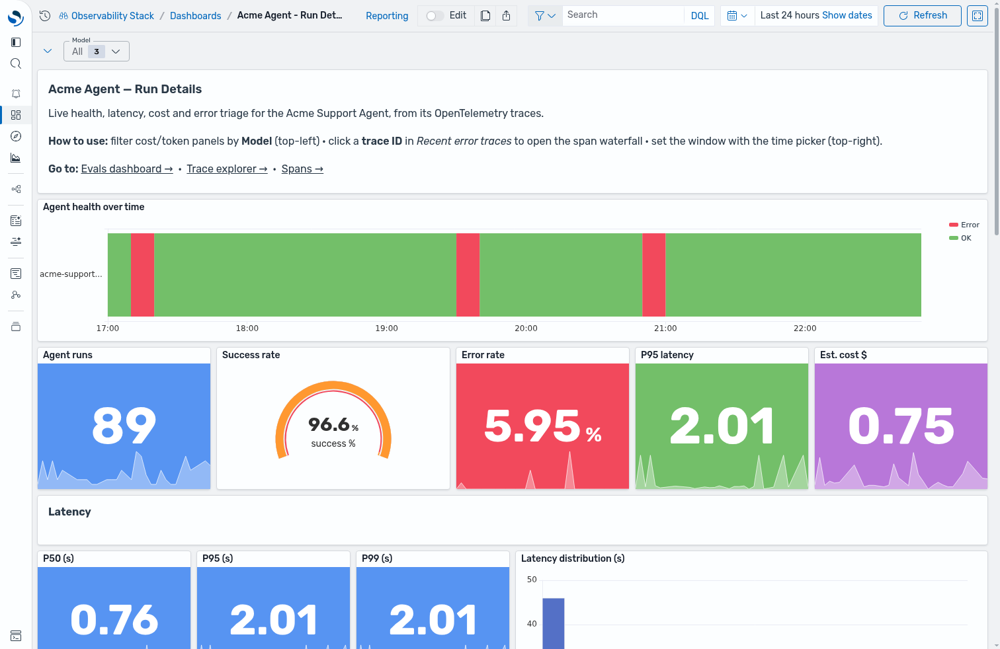
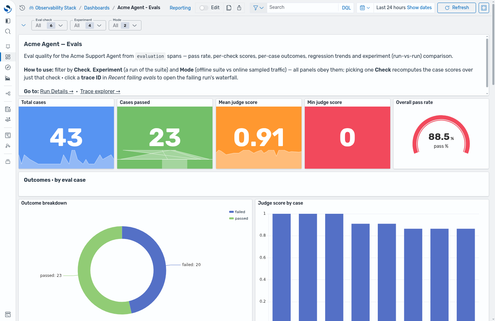

# Acme Agent Dashboards

Two curated OpenSearch Dashboards for the Acme Support Agent, built entirely from
**PPL** and **PromQL** `explore` panels (the same saved-object type the stack's own
samples use) plus Markdown overview blocks. Modeled on the eval + observability tools
teams already know — Arize/Phoenix, Braintrust, LangSmith, Langfuse — but expressed in
the PPL/PromQL `explore` framework:

- **Acme Agent — Run Details** — live health, latency, cost, and error triage.
- **Acme Agent — Evals** — eval quality: pass rate, per-check + per-case scores, trends,
  run-vs-run experiment comparison, and online-vs-offline split.

Both open with an **overview block** (what the dashboard is, how to use it, and links to
its sibling + the Agent Traces explorer), **filter variables** (Model on Run Details;
Check / Experiment / Mode on Evals) that default to *All*, and KPI cards that show a
**trend sparkline** behind the big number.




## Acme Agent — Run Details

| Panel | Answers | Chart | Query source |
|---|---|---|---|
| Agent health over time | Is the agent up? when did it error? | `state_timeline` | `max(status.code)` by 10-min bucket over `invoke_agent` spans (0→OK green, 2→Error red) |
| Agent runs | How many invocations? | metric + sparkline | `count()` of `invoke_agent` by bucket |
| Success rate | % of runs that didn't error | gauge | `avg(status.code≠2)` |
| Error rate | % of runs that errored | metric + sparkline | `avg(status.code=2)` by bucket |
| P95 latency | Tail latency (threshold-colored) | metric + sparkline | `percentile(durationInNanos,95)` by bucket |
| Est. cost $ | Rough $ from token sums (**Model**-filtered) | metric + sparkline | `sum(in)·$3/M + sum(out)·$15/M` by bucket |
| P50 / P95 / P99 (s) | Latency percentiles | metric + sparkline | `percentile(durationInNanos, N)` by bucket |
| Latency distribution (s) | Shape of the latency spread | `histogram` | per-span duration in seconds |
| Tokens by model | Which model burns tokens (**Model**-filtered) | bar | `sum(total_tokens)` by `request.model` |
| Tokens in vs out over time | Input/output token trend (**Model**-filtered) | stacked area | `sum(in)`, `sum(out)` by bucket |
| Tool analytics | Which tools run, how often, how slow | table | `count()`, `avg(durationInNanos)` by `tool.name` over `execute_tool` spans |
| Throughput (runs / 10m) | Traffic shape | line | `count()` of `invoke_agent` by bucket |
| Recent error traces | The 20 latest failures — **click a trace ID to open the span waterfall** | table + data-link | `status.code=2`, fields `traceId, endTime, name, exception.message` |
| Span ingest vs export rate | Is the collector keeping up? | line (PromQL) | `otelcol_receiver_accepted_spans_total` vs `otelcol_exporter_sent_spans_total` |
| Span export failures | Dropped spans | metric (PromQL) | `otelcol_exporter_send_failed_spans_total` |

## Acme Agent — Evals

Every panel reads one source — the `evaluation` spans — and applies **all three** filter
variables (**Check**, **Experiment**, **Mode**), so the variables govern the whole dashboard.
Each `evaluation` span carries `evaluation.name` + `.score.value` plus `eval_question`,
`test.suite.run.id` (a run), `test.suite.name` (the experiment) and `eval_mode`
(`offline` suite vs `online` sampled traffic), attached by `evals/run_evals.py` and
`evals/online.py`. A **case-run is one trace**, so `traceId` is the per-case-run key used for
pass/fail rollups; `eval_question` is the readable case label.

Picking a single **Check** recomputes the case-level numbers (Mean/Min score, pass/fail) over
just that check.

| Panel | Answers | Chart | Query (over `evaluation` spans) |
|---|---|---|---|
| Total cases | How many case-runs? | metric + sparkline | `distinct_count(traceId)` by bucket |
| Cases passed | How many case-runs passed every selected check? | metric + sparkline | `min(score) by traceId,bucket \| where m>=1 \| count() by bucket` |
| Mean judge score | Average score over selected checks | metric + sparkline | `avg(score)` by bucket |
| Min judge score | Worst score in the window | metric | `min(score)` |
| Overall pass rate | Aggregate check quality | gauge | `avg(score)` |
| Outcome breakdown | Passed vs failed case-runs | donut (pie) | `min(score) by traceId` → `passed`/`failed` → `count()` |
| Judge score by case | Which question scores worst | bar | `avg(score)` by `eval_question` |
| Pass rate by check | Which criterion is weakest | `bar_gauge` | `avg(score)` by `evaluation.name`, threshold-colored |
| Failing checks by metric | Where failures concentrate | bar | `count()` where score `< 1` by `evaluation.name` |
| Mean judge score trend | Quality over time | line | `avg(score)` by bucket |
| Cases passed / 10m | Passing throughput | line | passing case-runs by bucket |
| Per-case score over runs | Per-question regression trend | multi-line | `avg(score)` by bucket, `eval_question` |
| Failing checks over time | Failure trend | stacked area | `count()` where score `< 1` by bucket, `evaluation.name` |
| Mean score by run | Run-vs-run (experiment) comparison | bar | `avg(score)` by `test.suite.run.id` |
| Eval volume by mode | Offline suite vs online sampling over time | stacked area | `count()` by bucket, `eval_mode` |
| Per-case detail | Score + failing-check count per case | table | `avg(score)`, `sum(score<1)`, `count()` by `eval_question` |
| Failing checks | The failing criteria, ranked | table | `count()` where score `< 1` by `evaluation.name` |
| Recent failing evals | The 20 latest failing checks — **click a trace ID to open the run** | table + data-link | score `< 1`: `eval_question`, check, score, `traceId` |

## How to read it

- **Health strip** — one row of 10-minute buckets colored green (all runs OK) or red (any
  `status.code=2` in the bucket). A red band tells you *when* to zoom the time picker.
- **Gauges vs sparkline cards** — deliberate contrast. Gauges (success rate, pass rate) show
  *current health* against thresholds; the KPI cards show a *trend* (the sparkline behind the
  number is the same metric bucketed over the window).
- **Filter variables** — **Model** (Run Details) and **Check / Experiment / Mode** (Evals) all
  default to *All*. On Evals every panel obeys all three; picking one **Check** recomputes the
  case-level Mean/Min score and pass/fail over just that check, **Experiment** isolates one run of
  the suite (for run-vs-run comparison), and **Mode** splits the offline suite from online sampled
  traffic. On Run Details the **Model** filter scopes only the model-bearing cost/token panels; the
  health/latency/tool/pipeline panels carry no `request.model`, so they stay unfiltered.
- **Trace drill-down** — in *Recent error traces* (Run Details) and *Recent failing evals* (Evals),
  the `traceId` column is a data-link into the **Agent Traces** trace-detail waterfall (opens in a
  new tab). Nav links and the drill-down
  carry the `now-24h` window across.

## Install (auto-load on stack start)

`acme-dashboards-init.py` resolves the live `otel-v1-apm-span*` index-pattern id and the
`ObservabilityStack_Prometheus` data connection at runtime, removes the stack's demo dashboards
(Astronomy shop + service telemetry), queries the distinct Model / Check / Experiment / Mode
values so the filter variables default to *All*, and creates the two dashboards (idempotent —
fixed object ids, `overwrite=true`).

Bring the stack up with the override so it runs automatically after the stack's own
Dashboards init:

```bash
cd observability-stack
docker compose -f docker-compose.yml \
  -f ../acme-support-agent/dashboards/docker-compose.dashboards.yml up -d
```

The override also sets `INSTALL_VISUALIZATION_SAMPLES=false` so the bundled Flights /
viz-demo samples are skipped.

### Run it by hand (against an already-running stack)

```bash
OSD_BASE_URL=http://localhost:5601 python acme-support-agent/dashboards/acme-dashboards-init.py
```

Env: `OSD_BASE_URL`, `OSD_USER` (default `admin`), `OSD_PASSWORD`, `OPENSEARCH_URL`
(default `https://localhost:9200`, used to seed the filter variables' default-All values),
`WORKSPACE_NAME` (default `Observability Stack`), `SPAN_PATTERN` (default `otel-v1-apm-span*`),
and **`OSD_PUBLIC_URL`** — the browser-facing base used for the nav links and the error-table
**trace-ID drill-down** (data-links require an absolute URL). Defaults to `http://localhost:5601`;
set it to your published URL when serving remotely, e.g.
`OSD_PUBLIC_URL=https://my-host python .../acme-dashboards-init.py`. Nav links carry the
`now-24h` time range across to the Agent Traces app.

## Demo data (fault injection)

To populate the dashboards with a realistic **mix of successes and failures**, run the
mock-mode generator (offline, deterministic, no credentials):

```bash
./acme-support-agent/dashboards/demo-data.sh   # stack must be running (OTLP on 4318)
```

It drives baseline success traffic + a clean eval pass, then injects failures via the
`ACME_FAULT` env flag (mock adapter only, see `python/acme/faults.py`):

| `ACME_FAULT` | Effect | Shows up as |
|---|---|---|
| `error` | raises a simulated `ThrottlingException` | error-rate %, error-traces table, status.code=2 |
| `slow`  | sleeps past the 8s budget | P95 latency spike, `latency_ok` failures |
| `loop`  | repeats the tool call | `no_loops` failures |
| `wrong` | wrong tool + non-answer | `answer_correctness` / `right_tool` / `trajectory_match` failures |
| `cost`  | records a token blowup over budget | `cost` failures, big token bars |

Wait ~90s for Data Prepper ingestion, then refresh the dashboards. Default (no
`ACME_FAULT`) behavior is unchanged.

The generator emits every trace at the current time, which piles all points into one
bucket and leaves the trend charts / KPI sparklines flat. As a final step it therefore
waits for ingestion and **spreads the traces across the last ~6h** (deterministically, by
a hash of each `traceId`, preserving intra-trace timing) so the dashboards look like a
continuously-running agent. Set `SPREAD=0` to skip that and let the trends fill in as you
run the agent over time.

## Notes

- **PromQL scope:** the Python SDK exports traces only, so no per-agent metrics reach
  Prometheus — the PromQL panels use the collector's `otelcol_*` self-metrics
  (span ingest/export rate, export failures). All agent- and eval-specific numbers
  come from PPL over the traces index.
- **Filter defaults:** OpenSearch query-variables reset to the first option when no `current`
  is stored, so the init script seeds `current` with every value (== *All*). Re-running the
  init refreshes that list as new models / checks appear.
- Token fields are cast (`cast(... as int)`) in PPL sums, matching `verify/queries.md`.
- The dashboards read `endTime` as the time field for the span index pattern.
- **Eval attributes:** the Evals dashboard needs `eval_question`, `test.suite.run.id`,
  `test.suite.name`, `eval_mode` (and score) on the `evaluation` spans — attached by
  `evals/run_evals.py` (offline) and `evals/online.py` (online). Re-run the evals or
  `demo-data.sh` after pulling this change so those fields exist.
- **Online vs offline:** `run_evals.py` scores the full dataset against golden answers
  (`eval_mode=offline`); a sampled fraction of live `acme.run` turns scores the reference-free
  checks (latency/cost) with `eval_mode=online` when `ACME_ONLINE_EVAL_RATE>0` (the hook lives in
  `acme/agent.py`, in-span so scores attach to the live trace). `demo-data.sh` drives both.
- **Experiments:** each `run_evals` invocation mints a `test.suite.run.id`; set `ACME_EXPERIMENT`
  to label a run (default `<framework>@<model>`). The "Mean score by run" panel + Experiment
  filter compare runs (v1 vs v2).
- **Mock models:** in mock mode each turn picks one of a few real Bedrock model IDs (random), so
  the Model filter has variety; pin one with `ACME_MODEL`. Mock also adds a small random latency
  (0.05–0.9s) so the P50/P95/P99 cards and latency distribution show a realistic spread.
- **Token panels** sum `input_tokens + output_tokens` (not `total_tokens`, which the mock adapter
  doesn't emit) so cost/token viz populate in both mock and real runs.
- **Rollover gotcha:** if Data Prepper rolls the span index over to a fresh empty
  `otel-v1-apm-span-00000N`, its template maps `events.attributes` as a scalar while the
  populated index has it as an object — the mismatch makes wildcard PPL fail to plan
  (`UnsupportedOperationException` at the analyzing stage) and every panel shows an error.
  A single demo run won't trigger a rollover. If you hit it, **do not just delete the empty
  index** — it is the alias's *write index*, and deleting it makes Data Prepper drop every new
  span (`no write index is defined for alias [otel-v1-apm-span]`). Instead point the alias's
  write flag back at the populated index, then delete the empty one:
  ```
  POST _aliases {"actions":[{"add":{"index":"otel-v1-apm-span-000001","alias":"otel-v1-apm-span","is_write_index":true}}]}
  DELETE otel-v1-apm-span-00000N
  ```
- **Scoped out** (not expressible in a static PPL/PromQL dashboard): human-annotation queues,
  drift detection (needs the Anomaly Detection / Alerting plugins), and the span waterfall
  itself — which the linked **Agent Traces app** provides.
